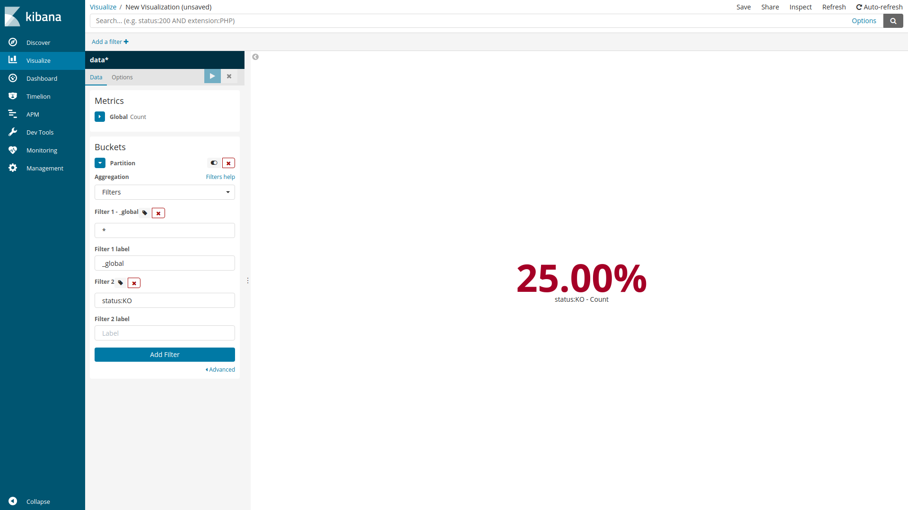
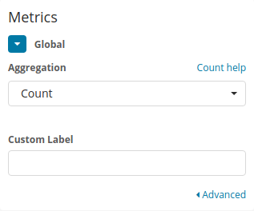
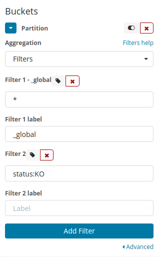
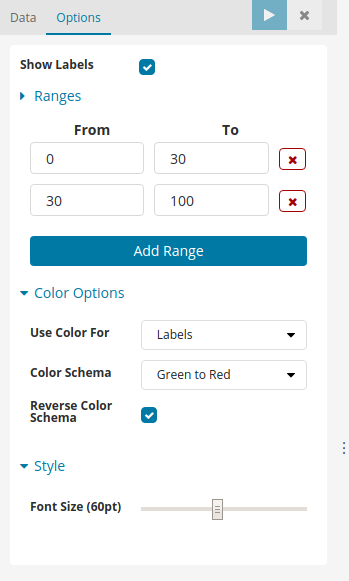

# Percent visualization for Kibana
A percent visualization for Kibana, with builds available for both Kibana 4.6.x and Kibana 5.x.x.

The visualization displays a percent number based on a global number and various values.
* [Source](https://github.com/amannocci/kibana-plugin-metric-percent)
* [Issues](https://github.com/amannocci/kibana-plugin-metric-percent/issues)
* [Contact](mailto:adrien.mannocci@gmail.com)



## Compatibility
Different releases of the plugin are available to work with either Kibana 4 or Kibana 5.

## Sandbox
You can test this plugin within a kibana docker container
```bash
#!/bin/bash
VERSION="5.4.3"
git clone https://github.com/amannocci/kibana-plugin-metric-percent plugins/kibana-plugin-metric-percent
docker run --name kibana-$VERSION --net=host -e ELASTICSEARCH_URL=http://localhost:9200 -v $PWD/plugins:/usr/share/kibana/plugins -d kibana:$VERSION --plugins /usr/share/kibana/plugins
```

## Usage
The first step in creating the visualization is to configure the metric that will be displayed.

Select the Elasticsearch aggregation to be used - count and unique count are currently available.



The next step is to configure some partitions.

You need to define a partition called `_global` which will be the base number.

Then you can define all others partitions with custom label.



## Options
The options tab allows you to configure the font size and whether or not you want to display values behind percents.


